# Usecase Tổng Quát - Hệ Thống Quản Lý Thuê Xe

## Sơ đồ Usecase (PlantUML)

```plantuml
@startuml RentalCarSystem_UsecaseTQ

left to right direction
skinparam packageStyle rectangle
skinparam actorStyle awesome

actor "Rental\n(Khách thuê)" as Rental #LightYellow

rectangle "Hệ Thống Quản Lý Thuê Xe" {

  package "Xác thực & Tài khoản" {
    usecase "Đăng ký tài khoản" as UC_Register
    usecase "Đăng nhập" as UC_Login
    usecase "Đăng nhập mạng xã hội" as UC_SocialLogin
    usecase "Xác thực OTP" as UC_OTP
    usecase "Làm mới Access Token" as UC_RefreshToken
    usecase "Đổi mật khẩu" as UC_ChangePassword
    usecase "Quên mật khẩu" as UC_ForgotPassword
  }

  package "Quản lý Xe (Fleet)" {
    usecase "Thêm xe mới" as UC_AddCar
    usecase "Cập nhật thông tin xe" as UC_UpdateCar
    usecase "Xóa xe" as UC_DeleteCar
    usecase "Xem danh sách xe của mình" as UC_ViewOwnCars
    usecase "Quản lý giá thuê xe" as UC_ManagePricing
    usecase "Quản lý lịch khóa xe" as UC_ManageAvailability
    usecase "Upload ảnh xe" as UC_UploadCarImage
  }

  package "Đặt xe & Thuê xe" {
    usecase "Tìm kiếm xe available" as UC_SearchCar
    usecase "Tạo đơn đặt xe" as UC_CreateBooking
    usecase "Xem chi tiết đặt xe" as UC_ViewBooking
    usecase "Hủy đặt xe" as UC_CancelBooking
    usecase "Xác nhận / Từ chối đặt xe" as UC_ConfirmBooking
    usecase "Hoàn thành chuyến xe" as UC_CompleteBooking
    usecase "Xem lịch sử đặt xe" as UC_BookingHistory
    usecase "Áp dụng mã khuyến mãi" as UC_ApplyPromotion
  }

  package "Thanh toán" {
    usecase "Thanh toán tiền thuê xe" as UC_Pay
    usecase "Xem lịch sử giao dịch" as UC_ViewTransactions
    usecase "Hoàn tiền (refund)" as UC_Refund
  }

  package "Đánh giá & Phản hồi" {
    usecase "Viết đánh giá sau chuyến" as UC_WriteReview
    usecase "Xem đánh giá xe" as UC_ViewReviews
    usecase "Xóa đánh giá vi phạm" as UC_DeleteReview
  }

  package "Vận hành (Ops)" {
    usecase "Lập báo cáo hư hỏng" as UC_DamageReport
    usecase "Tạo phạt vi phạm" as UC_CreatePenalty
    usecase "Xem danh sách phạt" as UC_ViewPenalties
    usecase "Xử lý phạt" as UC_HandlePenalty
  }

  package "Payout Chủ xe" {
    usecase "Xem thu nhập / payout" as UC_ViewPayout
    usecase "Yêu cầu rút tiền" as UC_RequestPayout
    usecase "Duyệt & xử lý payout" as UC_ApprovePayout
  }

  package "Quản trị hệ thống" {
    usecase "Quản lý người dùng" as UC_ManageUsers
    usecase "Phân quyền / Roles" as UC_ManagePermissions
    usecase "Quản lý hãng xe & dòng xe" as UC_ManageBrandModel
    usecase "Quản lý địa điểm" as UC_ManageLocations
    usecase "Quản lý khuyến mãi" as UC_ManagePromotions
    usecase "Xem báo cáo toàn hệ thống" as UC_SystemReport
    usecase "Quản lý API Key" as UC_ManageApiKey
    usecase "Gửi email thông báo" as UC_SendEmail
  }
}

actor "Owner\n(Chủ xe)" as Owner #LightGreen
actor "Admin" as Admin #LightBlue

' === RENTAL (bên trái) ===
Rental --> UC_Register
Rental --> UC_Login
Rental --> UC_SocialLogin
Rental --> UC_OTP
Rental --> UC_RefreshToken
Rental --> UC_ChangePassword
Rental --> UC_ForgotPassword
Rental --> UC_SearchCar
Rental --> UC_CreateBooking
Rental --> UC_ViewBooking
Rental --> UC_CancelBooking
Rental --> UC_BookingHistory
Rental --> UC_ApplyPromotion
Rental --> UC_Pay
Rental --> UC_ViewTransactions
Rental --> UC_WriteReview
Rental --> UC_ViewReviews
Rental --> UC_DamageReport

' === OWNER (bên phải) ===
Owner --> UC_Login
Owner --> UC_OTP
Owner --> UC_RefreshToken
Owner --> UC_ChangePassword
Owner --> UC_AddCar
Owner --> UC_UpdateCar
Owner --> UC_DeleteCar
Owner --> UC_ViewOwnCars
Owner --> UC_ManagePricing
Owner --> UC_ManageAvailability
Owner --> UC_UploadCarImage
Owner --> UC_ConfirmBooking
Owner --> UC_CompleteBooking
Owner --> UC_ViewBooking
Owner --> UC_BookingHistory
Owner --> UC_ViewReviews
Owner --> UC_ViewPayout
Owner --> UC_RequestPayout
Owner --> UC_DamageReport
Owner --> UC_ViewPenalties

' === ADMIN (bên phải) ===
Admin --> UC_Login
Admin --> UC_ManageUsers
Admin --> UC_ManagePermissions
Admin --> UC_ManageBrandModel
Admin --> UC_ManageLocations
Admin --> UC_ManagePromotions
Admin --> UC_SystemReport
Admin --> UC_ManageApiKey
Admin --> UC_SendEmail
Admin --> UC_ApprovePayout
Admin --> UC_ViewPayout
Admin --> UC_DeleteReview
Admin --> UC_CreatePenalty
Admin --> UC_HandlePenalty
Admin --> UC_ViewPenalties
Admin --> UC_Refund
Admin --> UC_ViewTransactions

@enduml
```

---

## Mô tả Actors

| Actor | Vai trò |
|-------|---------|
| **Admin** | Quản trị viên hệ thống: quản lý người dùng, phân quyền, danh mục dữ liệu (hãng xe, địa điểm, khuyến mãi), xem báo cáo toàn hệ thống, duyệt payout, xử lý phạt & hoàn tiền. |
| **Owner** | Chủ xe: đăng ký/đăng nhập, quản lý đội xe (thêm/sửa/xóa xe, giá thuê, lịch khóa), xác nhận/từ chối đặt xe, xem thu nhập & yêu cầu rút tiền. |
| **Rental** | Khách thuê: tìm kiếm xe, đặt xe, thanh toán, hủy đặt, viết đánh giá, xem lịch sử chuyến đi. |

---

## Nhóm Usecase Chính

| Nhóm | Actors liên quan | Mô tả |
|------|-----------------|-------|
| Xác thực & Tài khoản | Rental, Owner, Admin | Đăng ký, đăng nhập, OTP, refresh token, đổi/quên mật khẩu, social login |
| Quản lý Xe (Fleet) | Owner, Admin | CRUD xe, định giá thuê, khóa lịch xe, upload ảnh |
| Đặt xe & Thuê xe | Rental, Owner | Tìm kiếm, tạo/hủy/xác nhận/hoàn thành đơn, áp dụng khuyến mãi |
| Thanh toán | Rental, Admin | Thanh toán, xem giao dịch, hoàn tiền |
| Đánh giá | Rental, Owner, Admin | Viết/xem đánh giá; Admin xóa nội dung vi phạm |
| Vận hành (Ops) | Rental, Owner, Admin | Báo cáo hư hỏng, tạo & xử lý phạt vi phạm |
| Payout Chủ xe | Owner, Admin | Xem thu nhập, yêu cầu & duyệt rút tiền |
| Quản trị hệ thống | Admin | Quản lý users, roles/permissions, danh mục, khuyến mãi, API key, gửi email |
